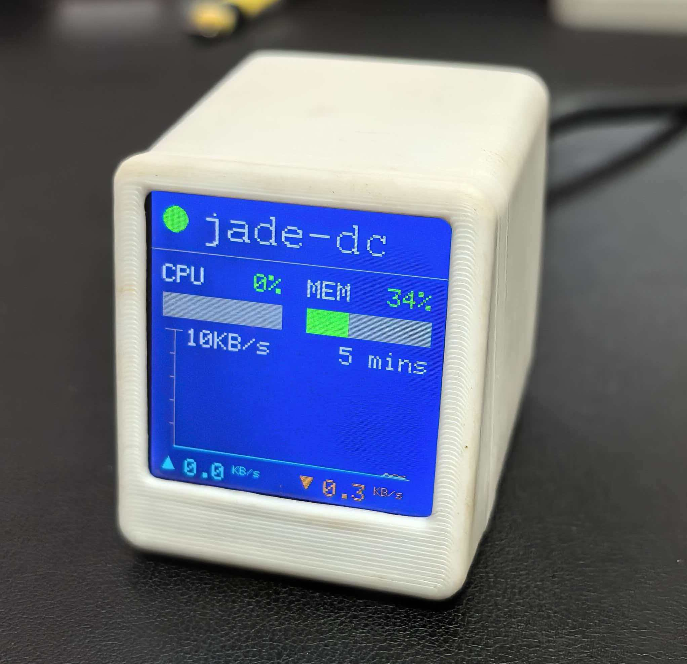

# J-Monitor
J-Monitor 是基于 ESP8266 的设备监控屏固件，适配群晖（可修改适配其他网络设备或NAS）。
````markdown
# J-Monitor
J-Monitor 是基于 ESP8266 的设备监控屏固件，适配群晖（可修改适配其他网络设备或NAS）。
基于立创开源平台上“时钟天气站”项目的硬件，编写的适配固件。
固件通过 SNMP 周期轮询被监控设备，显示 CPU、内存、接口流量等关键指标，并在 TFT 屏上以图表/数值形式展现。


**主要功能**

- 实时轮询 SNMP 设备并展示关键性能指标（CPU、内存、吞吐量等）。
- 在 TFT 屏上显示数值与简单图形（折线/柱状），支持多设备轮询。
- 基于 PlatformIO 构建，集成 `TFT_eSPI` 驱动库。
- 项目配置采用本地私有配置 `include/config_local.h`（该文件被 `.gitignore` 忽略），避免将凭据提交到仓库；也支持通过 `platformio.ini` 注入编译宏。

**仓库结构（相关）**

- `src/`：固件源码，入口为 `src/main.cpp`。
- `include/`：配置头文件（`config.h`、`Setup_ESP8266_SD2.h` 等）。
- `lib/TFT_eSPI/`：屏幕驱动库（已包含在仓库中以便适配硬件）。

**硬件**

此固件面向基于 ESP8266 的开发板和 TFT 屏（与“时钟天气站”硬件兼容）。常见元件：

- ESP8266 开发板（例如 NodeMCU / Wemos D1 mini）
- TFT 显示屏（SPI，视 `TFT_eSPI` 配置而定）
- 电源与若干杜邦线

在具体接线前，请先确认你所用显示屏的接口类型（SPI / 并口）并参考 `lib/TFT_eSPI/README.md` 或 `User_Setup.h` 完成引脚配置。

配置与接线（概览）

-- 配置请使用本地私有文件 `include/config_local.h`（推荐）：复制 `include/config_local.h.example` 为 `include/config_local.h`，填写你的 WiFi/网络/SNMP 信息，仓库已将 `include/config_local.h` 加入 `.gitignore`，不会被提交。
- 也可通过 `platformio.ini` 的 `build_flags` 使用 `-D` 将宏注入编译器，但不建议将敏感信息写入版本控制中的 `platformio.ini`。
- 若屏幕需要特殊引脚配置，请修改 `lib/TFT_eSPI/User_Setup.h` 或通过 `Setup_ESP8266_SD2.h` 选择适配项。
- 若使用 SD 卡，请确认 `Setup_ESP8266_SD2.h` 中的 CS/CLK/MISO/MOSI 引脚设置与实际接线一致。

示例（使用本地私有配置）：

1. 复制示例文件为本地配置并编辑：

```bash
cp include/config_local.h.example include/config_local.h
# 然后编辑 include/config_local.h，填写真实 SSID / 密码 / COMMUNITY 等
```

2. `include/config.h` 会优先包含 `include/config_local.h`（若存在），否则使用默认值或通过编译器 `-D` 注入的宏。

构建与上传

使用 PlatformIO 构建并上传固件：

```bash
# 在项目根目录下（包含 platformio.ini）
pio run                # 构建固件
pio run -t upload      # 上传到连接的开发板
pio device monitor -b 115200  # 打开串口监视器（查看日志）
```

使用说明

- 首次使用：复制并填写本地配置：

```bash
cp include/config_local.h.example include/config_local.h
# 编辑 include/config_local.h，填写你的 WIFI_SSID、WIFI_PASSWORD、COMMUNITY 等
```

- 构建并上传固件到 ESP8266：

```bash
pio run
pio run -t upload
pio device monitor -b 115200
```

- 通过串口查看日志，确认设备已成功连接 WiFi 并开始轮询 SNMP 目标；屏幕将按配置显示被监控设备的指标。

常见故障排查

- 屏幕无显示：检查电源与显示器接口，引脚配置是否与 `TFT_eSPI` 设置一致。
- 无法连接 WiFi：确认 `include/config_local.h`（或 `platformio.ini` 注入的宏）中 SSID/密码正确，串口日志可提供失败原因。
- 无法获取 SNMP 数据：确认被监控设备启用了 SNMP 服务、community 值正确、网络可达。

自定义与扩展

- 若要改变显示布局或颜色，请修改 `src/` 中的显示渲染代码或调整 `TFT_eSPI` 的字体/旋转设置。
- 若需支持更多 SNMP OID 或自定义图表，可在轮询模块中添加相应 OID 并在界面渲染函数中绘制。

```

**License**

- 本项目采用 MIT 许可证，详见 `LICENSE` 文件。
